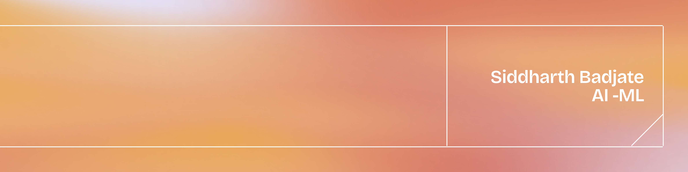

I'm an AI/ML engineer and researcher from India. I refuse to treat models as black boxes, I like to dive into the fundamentals. Why did the loss curve stop going down here? What exactly did that attention head learn? It's never just about using the tools, it's about taking them apart to understand what's happening underneath.

Currently engineering **DhanNiti**, an advanced Reinforcement Learning portfolio optimizer built with Stable-Baselines3, FastAPI, and Next.js. The PPO agent leverages technical indicators and time-series forecasting to capture algorithmic alpha, with a custom friction-aware backtester and automated DagsHub/MLflow integration for rigorous quantitative evaluation.

---

### Tech Stack
**Languages**  

  
  
  
  
  
  
  
  

**AI, Machine Learning & Data**  

  
  
  
  

**Architecture & Tools**  

  
  
  
  
  
  
  
  

### GitHub Stats

  

### Contact

  
  &nbsp;
  

